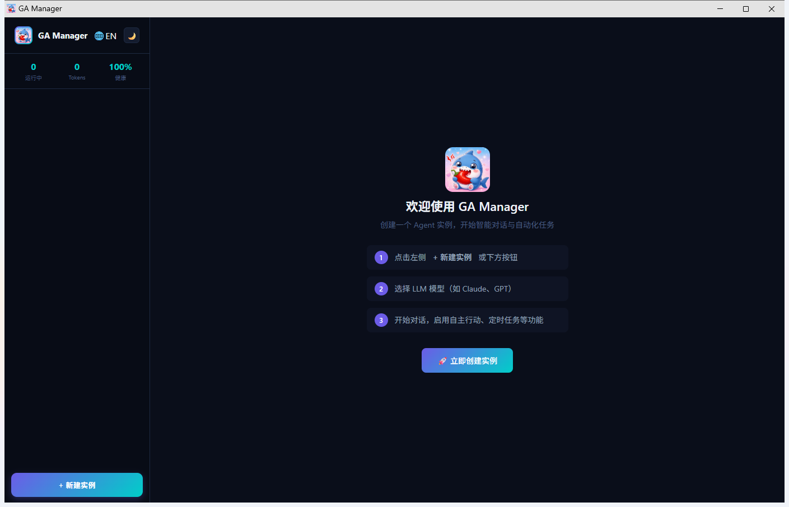
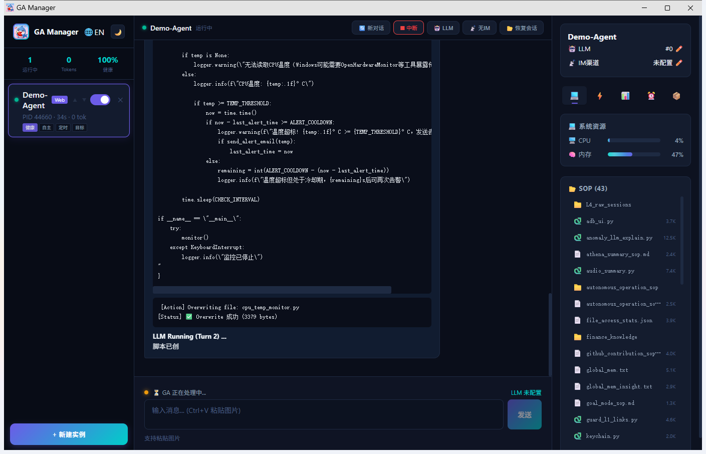

<p align="center">
  
</p>

<h1 align="center">GA Manager</h1>

<p align="center">
  <strong>Multi-instance GenericAgent Management Panel</strong><br/>
  Create, monitor, and orchestrate AI agent instances from a sleek desktop interface.
</p>

<p align="center">
  <a href="README_zh.md">🇨🇳 中文文档</a> •
  <a href="https://github.com/chilishark27/GenericAgent">GenericAgent</a> •
  <a href="#quick-start">Quick Start</a>
</p>

---

## Screenshots

<p align="center">
  
</p>

<p align="center">
  
</p>

---

## Features

| Feature | Description |
|---------|-------------|
| 🖥️ **Instance Management** | Create, delete, reorder, and monitor multiple GA instances simultaneously |
| 💬 **Real-time Chat** | Stream-based conversation with live markdown rendering and status indicators |
| 🎯 **Goal Mode** | Set a persistent goal that guides the agent's behavior across all interactions |
| 🤝 **Peer Hint** | Inject system-level hints to shape the agent's response style |
| 🔄 **Reflect Mode** | Agent automatically reflects and summarizes after each response |
| 🤖 **Autonomous Mode** | Agent continues working independently in a loop without user input |
| 📨 **Message Forward** | Route messages between instances for multi-agent collaboration |
| ⏰ **Scheduled Tasks** | Set up cron-based recurring tasks for any instance |
| 📋 **SOP Browser** | Browse and view all available Standard Operating Procedures |
| 💻 **System Resources** | Monitor CPU, memory, disk usage in real-time |
| ⬆️ **Input History** | Press ↑/↓ to browse previously sent messages (persisted in localStorage) |
| ⚡ **Long Chat Optimization** | Auto-virtualizes messages beyond 150 for smooth scrolling in long conversations |
| 🌐 **i18n** | Full Chinese / English interface toggle |

---

## Feature Demos

### 🎯 Goal Mode

Set a persistent objective. The agent will reference this goal in every interaction.

```
POST /api/instances/{id}/chat
Body: {"message": "Monitor CPU temperature and alert when above 80°C"}

# With goal set to "System monitoring specialist":
# → Agent responds with focused, domain-specific solutions
```

**Verified result**: Agent generates complete monitoring scripts aligned with the stated goal.

---

### 🤝 Peer Hint

Inject invisible system instructions that shape how the agent responds.

```
POST /api/instances/{id}/chat
Body: {"message": "Explain Docker networking"}

# With peer_hint = "Reply concisely with code examples first":
# → Agent leads with code, keeps explanations brief
```

**Verified result**: Response style visibly changes — shorter prose, more code blocks.

---

### 🔄 Reflect Mode

After each response, the agent appends a `<summary>` reflection analyzing its own output.

```
Agent response:
"Here's the monitoring script..."

<summary>Provided a psutil-based CPU monitor with email alerts.
Could improve by adding GPU temperature support.</summary>
```

**Verified result**: Every response includes a self-assessment summary tag.

---

### 🤖 Autonomous Mode

The agent enters a self-driven loop, executing tasks without waiting for user input.

```
# Enable autonomous → send initial task → agent continues on its own
POST /api/instances/{id}/chat
Body: {"message": "Create test files and verify they exist"}

# Agent autonomously:
# 1. Creates files
# 2. Verifies existence
# 3. Reports completion
```

**Verified result**: Agent created `test_auto.txt` and confirmed its existence without further prompts.

---

### 📨 Message Forward

Route a message from one instance to another for multi-agent collaboration.

```
POST /api/instances/{id}/forward
Body: {"target_id": "instance-B-id", "message": "Please review this code"}

# Instance B receives: "[From instance a1b2c3d4] Please review this code"
# Instance B processes and responds independently
```

**Verified result**: Instance B received the forwarded message, processed it, and replied "Hello! Received. How can I help?"

---

## Quick Start

### Download

Grab the latest release from [Releases](https://github.com/chilishark27/ga-manager/releases), or build from source.

### Prerequisites

- [GenericAgent](https://github.com/chilishark27/GenericAgent) installed
- Python 3.10+
- Windows 10/11 or macOS 12+

### Run

1. Launch `ga_manager.exe`
2. Click ⚙️ to configure:
   - **GA Project Path** — your GenericAgent directory
   - **Python Path** — Python interpreter
3. Click **+ New Instance** to create an agent
4. Start chatting!

---

## Build from Source

A cross-platform `Makefile` is provided for streamlined builds.

### Using Makefile (Recommended)

```bash
# Clone
git clone https://github.com/chilishark27/ga-manager.git
cd ga-manager

# Windows (can be built from any OS)
make build-windows

# macOS Apple Silicon (must run ON a Mac)
make build-mac-arm64

# macOS Intel (must run ON a Mac)
make build-mac-amd64

# Backend-only for macOS (cross-compilable from Windows/Linux)
make build-backend-mac

# Package into ZIP
make package

# Clean
make clean
```

### Manual Build (Windows)

```bash
cd frontend
npm install
npx vite build --outDir ../build/static
cd ..

cd backend
go build -o ../build/ga_manager_backend.exe .
cd ..

cd desktop
go build -o ../build/ga_manager.exe .
cd ..
```

### Manual Build (macOS)

```bash
cd frontend
npm install
npm run build
cp -r dist ../backend/static
cd ..

cd backend
GOOS=darwin CGO_ENABLED=0 go build -ldflags="-s -w" -o ../build/ga_manager .
cd ..

# Desktop requires CGO (Cocoa framework for systray)
cd desktop
GOOS=darwin CGO_ENABLED=1 go build -ldflags="-s -w" -o ../build/ga-manager-desktop .
cd ..
```

> **Note**: The desktop wrapper uses `systray` which depends on Cocoa on macOS, so it **must be compiled on a Mac** with CGO enabled. The backend is pure Go and can be cross-compiled from any platform.

### Requirements

- Go 1.21+
- Node.js 18+ & npm
- macOS: Xcode Command Line Tools (for CGO/systray)

---

## API Reference

| Method | Endpoint | Description |
|--------|----------|-------------|
| `GET` | `/api/instances` | List all instances |
| `POST` | `/api/instances` | Create instance |
| `DELETE` | `/api/instances/{id}` | Delete instance |
| `POST` | `/api/instances/{id}/chat` | Send message |
| `POST` | `/api/instances/{id}/new_session` | Start new conversation |
| `POST` | `/api/instances/{id}/forward` | Forward to another instance |
| `GET` | `/api/instances/{id}/sessions` | List session files |
| `GET` | `/api/instances/{id}/sessions/{file}` | Get session content |
| `GET` | `/api/sop/list` | List available SOPs |
| `GET` | `/api/sop/content?name=X` | Read SOP content |
| `GET` | `/api/system/resources` | System resource stats |
| `WS` | `/api/instances/{id}/ws` | Real-time event stream |

---

## Architecture

```
┌─────────────────────────────────────────────┐
│              Desktop (WebView2)              │
├─────────────────────────────────────────────┤
│         Frontend (React + TypeScript)        │
├─────────────────────────────────────────────┤
│           Backend (Go HTTP + WS)            │
├─────────────────────────────────────────────┤
│     GenericAgent (Python) × N instances     │
└─────────────────────────────────────────────┘
```

---

## Language Switch

Click the 🌐 button in the sidebar to toggle between Chinese and English.

## Acknowledgments

This project is built on top of [GenericAgent](https://github.com/lsdefine/GenericAgent) by [@Ironman](https://github.com/lsdefine). GA Manager serves as a multi-instance desktop management layer for GenericAgent, providing GUI orchestration, real-time monitoring, and inter-agent collaboration capabilities.

Thanks to the GenericAgent community for the powerful agent framework that makes this project possible.

## License

MIT
