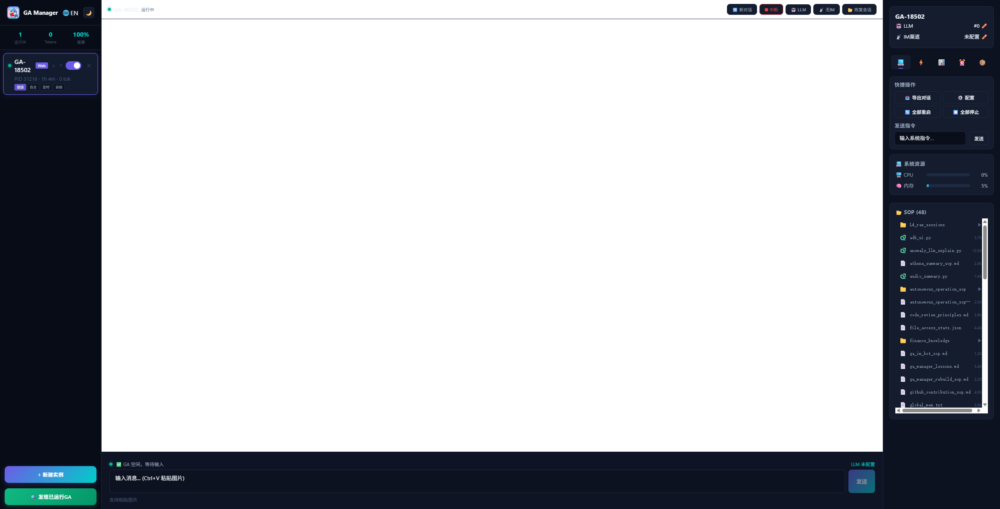
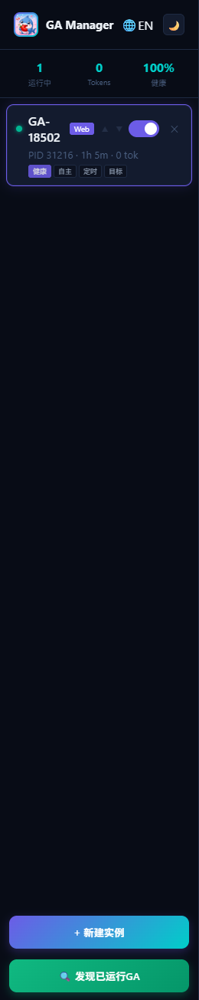
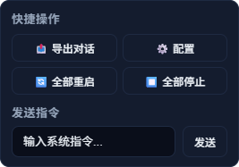
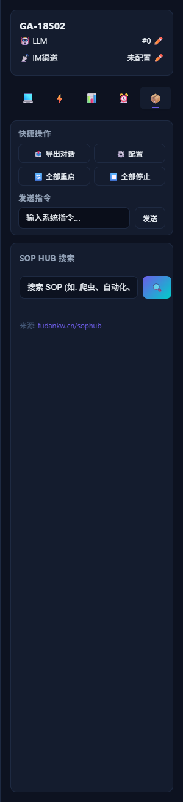
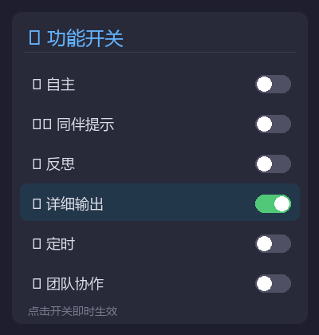

<p align="center">
  
</p>

<h1 align="center">GA Manager</h1>

<p align="center">
  <strong>Multi-instance GenericAgent Management Panel</strong><br/>
  Create, monitor, and orchestrate AI agent instances from a sleek desktop interface.
</p>

<p align="center">
  <a href="README_zh.md">🇨🇳 中文文档</a> •
  <a href="https://github.com/chilishark27/GenericAgent">GenericAgent</a> •
  <a href="#quick-start">Quick Start</a>
</p>

---

## Screenshots

### Main Interface — Chat with Agent
<p align="center">
  
</p>

### Instance Sidebar
<p align="center">
  
</p>

### Quick Actions
<p align="center">
  
</p>

### Scheduled Tasks
<p align="center">
  
</p>

### SOP Browser
<p align="center">
  
</p>

---

## Features

| Feature | Description |
|---------|-------------|
| 🖥️ **Instance Management** | Create, delete, reorder, and monitor multiple GA instances simultaneously |
| 💬 **Real-time Chat** | Stream-based conversation with live markdown rendering and status indicators |
| 🎯 **Goal Mode** | Set a persistent goal that guides the agent's behavior across all interactions |
| 🤝 **Peer Hint** | Inject system-level hints to shape the agent's response style |
| 🔄 **Reflect Mode** | Agent automatically reflects and summarizes after each response |
| 🤖 **Autonomous Mode** | Agent continues working independently in a loop without user input |
| 📨 **Message Forward** | Route messages between instances for multi-agent collaboration |
| ⏰ **Scheduled Tasks** | Set up cron-based recurring tasks for any instance |
| 📋 **SOP Browser** | Browse and view all available Standard Operating Procedures with directory expansion |
| 🧹 **Clean Exit** | Properly closes browser window and all child processes on exit — no orphan windows |
| 💻 **System Resources** | Monitor CPU, memory, disk usage in real-time |
| ⬆️ **Input History** | Press ↑/↓ to browse previously sent messages (persisted in localStorage) |
| ⚡ **Long Chat Optimization** | Auto-virtualizes messages beyond 150 for smooth scrolling in long conversations |
| 🌐 **i18n** | Full Chinese / English interface toggle |

---

## Mode Reference

<p align="center">
  
</p>

The icon buttons on the right panel are mode toggles. Click to enable/disable. Here's what each mode does:

---

### 🤖 Autonomous Mode

| | |
|---|---|
| **Purpose** | Agent acts on its own when you're away |
| **Trigger** | Fires after **30 minutes of user inactivity** |
| **Behavior** | Agent reads its automation SOP and decides what to do next |
| **Use case** | Background monitoring, overnight tasks, periodic checks |

**How to use:**
1. Click the 🤖 button to enable (highlighted = active)
2. Use the app normally or walk away
3. After 30 min idle, the agent starts working autonomously

> 💡 No Goal required. The agent will decide what to do based on its automation SOP.

---

### 🎯 Goal Mode

| | |
|---|---|
| **Purpose** | Set a persistent objective that persists across all conversations |
| **Injection** | Appends `[Current Goal] xxx` to the system prompt |
| **Use case** | Keep the agent focused on a specific domain or task |

**How to use:**
1. Enter your goal text in the right panel's goal input
2. Example: `"You are a DevOps expert focused on K8s cluster operations"`
3. All subsequent responses will be guided by this goal

---

### 🧠 Peer Hint

| | |
|---|---|
| **Purpose** | Inject invisible system instructions to shape response style |
| **Injection** | Appends `[Peer Hint] xxx` to the system prompt |
| **vs Goal** | Goal = "what to do", Peer Hint = "how to do it" |
| **Use case** | Control output format, tone, verbosity |

**How to use:**
1. Click the 🧠 button to enable
2. Enter your hint in the input field
3. Example: `"Reply in Chinese, keep responses under 200 words, code-first"`

---

### 🔄 Reflect Mode

| | |
|---|---|
| **Purpose** | Agent self-checks after every action |
| **Injection** | Adds reflection directive to system prompt |
| **Behavior** | Each response ends with a `<summary>` tag: last result + next intent |
| **Use case** | Complex multi-step tasks, self-correction |

**How to use:**
1. Click the 🔄 button to enable
2. Every subsequent response will include a reflection summary
3. Helps the agent maintain direction in long conversations

```
Example output:
"Database migration script complete..."

<summary>Migration script generated covering 3 tables. Next: run tests to verify data integrity.</summary>
```

---

### 📝 Verbose Mode

| | |
|---|---|
| **Purpose** | Control output detail level |
| **Enabled** | Shows full reasoning process, tool call logs |
| **Disabled** | Shows only final results, hides intermediate steps |
| **Use case** | Enable when debugging, disable for clean output |

**How to use:**
1. Click the 📝 button to toggle
2. Default: enabled (shows everything)
3. When disabled, only the final response is visible

---

### 📅 Scheduler

| | |
|---|---|
| **Purpose** | Trigger agent tasks on a cron schedule |
| **Config** | Choose a preset or enter custom cron expression |
| **Presets** | Every 5min / 30min / hourly / daily 9:00 / daily 18:00 |
| **Use case** | Periodic reports, health checks, automated ops |

**How to use:**
1. Click the 📅 button to enable
2. Select frequency from dropdown (or enter custom cron)
3. Enter the task command in the input field
4. Agent executes automatically at the scheduled time

```
Example:
  Frequency: */30 * * * *  (every 30 minutes)
  Task: "Check server disk usage, alert if above 80%"
```

---

### 👥 Team Worker

| | |
|---|---|
| **Purpose** | Connect agent to a team collaboration board |
| **Config** | Team Base URL / Board Key / Agent Name |
| **Behavior** | Agent polls the board for tasks, executes, and reports back |
| **Use case** | Multi-agent collaboration, task distribution |

**How to use:**
1. Click the 👥 button to enable
2. Configure three parameters:
   - **Base URL**: Team server address
   - **Board Key**: Board identifier (agents on the same board share tasks)
   - **Name**: This agent's name in the team
3. Agent automatically joins the team and picks up tasks

---

## Recommended Combinations

| Scenario | Modes |
|----------|-------|
| Daily dev assistant | Goal + Peer Hint + Verbose |
| Background automation | Autonomous + Reflect |
| Scheduled ops | Scheduler + Goal |
| Multi-agent team | Team Worker + Reflect |
| Debugging | Verbose + Reflect |

---

### 📨 Message Forward

Route a message from one instance to another for multi-agent collaboration.

```
Select target instance in right panel → enter message → click Forward

# Instance B receives: "[From instance a1b2c3d4] Please review this code"
# Instance B processes and responds independently
```

---

## Quick Start

### Download

Grab the latest release from [Releases](https://github.com/chilishark27/ga-manager/releases), or build from source.

### Prerequisites

- [GenericAgent](https://github.com/chilishark27/GenericAgent) installed
- Python 3.10+
- Windows 10/11 or macOS 12+

### Run

1. Launch `ga_manager.exe`
2. Click ⚙️ to configure:
   - **GA Project Path** — your GenericAgent directory
   - **Python Path** — Python interpreter
3. Click **+ New Instance** to create an agent
4. Start chatting!

---

## Build from Source

A cross-platform `Makefile` is provided for streamlined builds.

### Using Makefile (Recommended)

```bash
# Clone
git clone https://github.com/chilishark27/ga-manager.git
cd ga-manager

# Windows (can be built from any OS)
make build-windows

# macOS Apple Silicon (must run ON a Mac)
make build-mac-arm64

# macOS Intel (must run ON a Mac)
make build-mac-amd64

# Backend-only for macOS (cross-compilable from Windows/Linux)
make build-backend-mac

# Package into ZIP
make package

# Clean
make clean
```

### Manual Build (Windows)

```bash
cd frontend
npm install
npx vite build --outDir ../build/static
cd ..

cd backend
go build -o ../build/ga_manager_backend.exe .
cd ..

cd desktop
go build -o ../build/ga_manager.exe .
cd ..
```

### Manual Build (macOS)

```bash
cd frontend
npm install
npm run build
cp -r dist ../backend/static
cd ..

cd backend
GOOS=darwin CGO_ENABLED=0 go build -ldflags="-s -w" -o ../build/ga_manager .
cd ..

# Desktop requires CGO (Cocoa framework for systray)
cd desktop
GOOS=darwin CGO_ENABLED=1 go build -ldflags="-s -w" -o ../build/ga-manager-desktop .
cd ..
```

> **Note**: The desktop wrapper uses `systray` which depends on Cocoa on macOS, so it **must be compiled on a Mac** with CGO enabled. The backend is pure Go and can be cross-compiled from any platform.

### Requirements

- Go 1.21+
- Node.js 18+ & npm
- macOS: Xcode Command Line Tools (for CGO/systray)

---

## API Reference

| Method | Endpoint | Description |
|--------|----------|-------------|
| `GET` | `/api/instances` | List all instances |
| `POST` | `/api/instances` | Create instance |
| `DELETE` | `/api/instances/{id}` | Delete instance |
| `POST` | `/api/instances/{id}/chat` | Send message |
| `POST` | `/api/instances/{id}/new_session` | Start new conversation |
| `POST` | `/api/instances/{id}/forward` | Forward to another instance |
| `GET` | `/api/instances/{id}/sessions` | List session files |
| `GET` | `/api/instances/{id}/sessions/{file}` | Get session content |
| `GET` | `/api/sop/list` | List available SOPs |
| `GET` | `/api/sop/content?name=X` | Read SOP content |
| `GET` | `/api/system/resources` | System resource stats |
| `WS` | `/api/instances/{id}/ws` | Real-time event stream |

---

## Architecture

```
┌─────────────────────────────────────────────┐
│              Desktop (WebView2)              │
├─────────────────────────────────────────────┤
│         Frontend (React + TypeScript)        │
├─────────────────────────────────────────────┤
│           Backend (Go HTTP + WS)            │
├─────────────────────────────────────────────┤
│     GenericAgent (Python) × N instances     │
└─────────────────────────────────────────────┘
```

---

## Language Switch

Click the 🌐 button in the sidebar to toggle between Chinese and English.

## Acknowledgments

This project is built on top of [GenericAgent](https://github.com/lsdefine/GenericAgent) by [@Ironman](https://github.com/lsdefine). GA Manager serves as a multi-instance desktop management layer for GenericAgent, providing GUI orchestration, real-time monitoring, and inter-agent collaboration capabilities.

Thanks to the GenericAgent community for the powerful agent framework that makes this project possible.

## License

MIT
