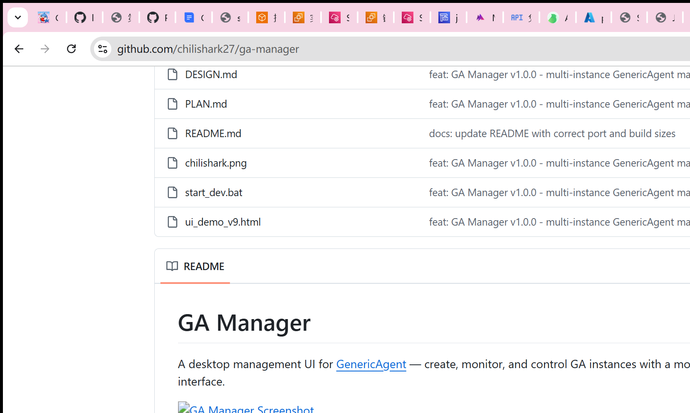

# GA Manager

A desktop management UI for [GenericAgent](https://github.com/chilishark27/GenericAgent) — create, monitor, and control GA instances with a modern dark-themed interface.



## Features

- 🖥️ **Instance Management** — Create, start, stop, and delete GA instances
- 💬 **Chat Interface** — Send messages to instances, view markdown-rendered responses
- ⏰ **Scheduled Tasks** — Cron-based task scheduling with preset templates
- 📦 **SOP Hub** — Search and download SOPs from the community hub
- 🌐 **Multi-language** — Chinese (中文) and English, switchable in sidebar
- 📱 **Responsive** — Works on screens from 1024px to 4K
- 🎨 **Dark Theme** — Easy on the eyes with a modern UI

## Quick Start

### Download Release

Download the latest release from [Releases](https://github.com/chilishark27/ga-manager/releases):
- `ga_manager_backend.exe` — HTTP backend server (serves UI + API)
- `ga_manager_desktop.exe` — Native desktop window (WebView2)

### Run

1. Place both executables in the same directory as your GA project (or configure the path in Settings)
2. Start `ga_manager_backend.exe` — starts HTTP server on port 3000
3. Start `ga_manager_desktop.exe` — opens the native window pointing to localhost:3000
4. Or just open `http://localhost:3000` in your browser

### Language Switch

Click the 🌐 button in the bottom-left corner of the sidebar to toggle between Chinese and English.

## Build from Source

### Prerequisites

- Go 1.21+
- Node.js 18+ & npm
- Windows (for desktop WebView2 build)

### Build Steps

```bash
# 1. Clone
git clone https://github.com/chilishark27/ga-manager.git
cd ga-manager

# 2. Build frontend
cd frontend
npm install
npx vite build --outDir ../build/static
cd ..

# 3. Build backend (embeds static files)
cd backend
go build -o ../build/ga_manager_backend.exe .
cd ..

# 4. Build desktop (optional, WebView2 wrapper)
cd desktop
go build -ldflags "-H windowsgui" -o ../build/ga_manager_desktop.exe .
cd ..
```

Output in `build/`:
- `ga_manager_backend.exe` (~10MB, includes embedded frontend)
- `ga_manager_desktop.exe` (~6MB, native window)
- `static/` (frontend assets, served by backend)

## Project Structure

```
ga-manager/
├── frontend/          # React + TypeScript + Vite
│   ├── src/
│   │   ├── components/   # Sidebar, ChatPanel, RightPanel
│   │   ├── i18n/         # Internationalization (zh/en)
│   │   ├── store/        # Zustand state management
│   │   └── App.tsx
│   └── package.json
├── backend/           # Go HTTP server + API proxy
│   └── main.go
├── desktop/           # Go WebView2 wrapper
│   └── main.go
├── build/             # Build output
└── screenshots/
```

## Configuration

On first launch, click ⚙️ in the right panel to configure:
- **GA Project Path** — Path to your GenericAgent installation
- **Python Path** — Python interpreter path

## Tech Stack

- **Frontend**: React 18, TypeScript, Vite, Zustand, react-markdown
- **Backend**: Go, net/http, embed
- **Desktop**: Go, WebView2

## License

MIT
