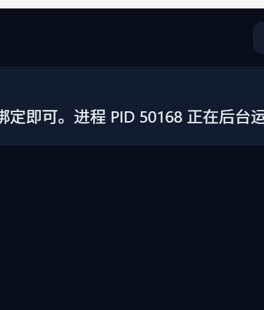

<p align="center">
  
</p>

<h1 align="center">GA Manager</h1>

<p align="center">
  <strong>多实例 GenericAgent 管理面板</strong><br/>
  创建、监控、编排 AI Agent 实例，深色主题桌面应用。
</p>

<p align="center">
  <a href="README.md">English</a> •
  <a href="https://github.com/chilishark27/GenericAgent">GenericAgent</a> •
  <a href="#快速开始">快速开始</a>
</p>

---

## 界面预览

<p align="center">
  
</p>

<p align="center">
  
</p>

---

## 功能一览

| 功能 | 说明 |
|------|------|
| 🖥️ **实例管理** | 同时创建、删除、排序、监控多个 GA 实例 |
| 💬 **实时对话** | 流式响应 + Markdown 实时渲染 + 状态指示器 |
| 🎯 **目标模式** | 设置持久目标，引导 Agent 在所有交互中围绕目标工作 |
| 🤝 **同伴提示** | 注入系统级提示词，塑造 Agent 回复风格 |
| 🔄 **反思模式** | Agent 每次回复后自动反思总结 |
| 🤖 **自主模式** | Agent 进入自驱循环，无需用户输入持续工作 |
| 📨 **消息转发** | 实例间消息路由，实现多 Agent 协作 |
| ⏰ **定时任务** | 为任意实例设置 cron 定时任务 |
| 📋 **SOP 浏览器** | 浏览和查看所有可用的标准操作流程 |
| 💻 **系统资源** | 实时监控 CPU、内存、磁盘使用率 |
| ⬆️ **输入历史** | 按 ↑/↓ 浏览已发送消息（持久化到 localStorage） |
| ⚡ **长对话优化** | 超过 150 条消息自动虚拟化，长对话滚动流畅不卡顿 |
| 🌐 **多语言** | 中文 / 英文界面一键切换 |

---

## 模式详解

<p align="center">
  
</p>

<p align="center">
  
</p>

右侧面板的图标按钮即为模式开关，点击切换开/关状态。以下是每个模式的详细说明：

---

### 🤖 自主模式 (Autonomous)

| 项目 | 说明 |
|------|------|
| **作用** | Agent 在用户离开后自动行动 |
| **触发条件** | 开启后，用户 **30 分钟无操作** 时自动触发 |
| **行为** | Agent 读取自动化 SOP，自主决定下一步任务并执行 |
| **适用场景** | 长时间挂机、后台监控、定期巡检 |

**使用方式**：
1. 点击 🤖 按钮开启（高亮表示已开启）
2. 正常使用或离开电脑
3. 30 分钟后 Agent 自动开始工作，面板显示 `autonomous_fired` 事件

> 💡 不需要设置 Goal 也能工作。Agent 会根据自动化 SOP 自行决定做什么。

---

### 🎯 目标模式 (Goal)

| 项目 | 说明 |
|------|------|
| **作用** | 为 Agent 设定持久目标，贯穿所有对话 |
| **注入位置** | 系统提示词中追加 `[当前目标] xxx` |
| **适用场景** | 让 Agent 始终围绕某个主题工作 |

**使用方式**：
1. 在右侧面板的目标输入框中填写目标文本
2. 例如：`"你是一个 DevOps 专家，专注于 K8s 集群运维"`
3. 之后所有对话中 Agent 都会参考此目标来组织回复

---

### 🧠 同伴提示 (Peer Hint)

| 项目 | 说明 |
|------|------|
| **作用** | 注入隐形系统指令，改变 Agent 回复风格 |
| **注入位置** | 系统提示词中追加 `[同伴提示] xxx` |
| **与 Goal 的区别** | Goal 是"做什么"，Peer Hint 是"怎么做" |
| **适用场景** | 控制输出格式、语气、详略程度 |

**使用方式**：
1. 点击 🧠 按钮开启
2. 在弹出的输入框中填写提示词
3. 例如：`"回复用中文，代码注释也用中文，每次回复不超过200字"`

---

### 🔄 反思模式 (Reflect)

| 项目 | 说明 |
|------|------|
| **作用** | Agent 每次行动后自我检查 |
| **注入位置** | 系统提示词追加反射指令 |
| **行为** | 每次回复末尾自动追加 `<summary>` 标签，包含：上次结果 + 本次意图 |
| **适用场景** | 复杂多步任务、需要 Agent 自我纠错 |

**使用方式**：
1. 点击 🔄 按钮开启
2. Agent 后续每条回复都会包含反思摘要
3. 摘要帮助 Agent 在长对话中保持方向感

```
Agent 回复示例：
"已完成数据库迁移脚本..."

<summary>迁移脚本已生成，覆盖3张表。下一步：运行测试验证数据完整性。</summary>
```

---

### 📝 详细输出 (Verbose)

| 项目 | 说明 |
|------|------|
| **作用** | 控制 Agent 输出详细程度 |
| **开启时** | Agent 输出完整的推理过程、工具调用日志 |
| **关闭时** | Agent 只输出最终结果，省略中间步骤 |
| **适用场景** | 调试时开启查看完整过程，日常使用关闭减少噪音 |

**使用方式**：
1. 点击 📝 按钮切换
2. 默认开启（显示所有输出）
3. 关闭后只看到最终回复，中间的工具调用和推理过程被隐藏

---

### 📅 定时任务 (Scheduler)

| 项目 | 说明 |
|------|------|
| **作用** | 按 cron 表达式定时触发 Agent 执行任务 |
| **配置** | 选择预设时间或自定义 cron 表达式 |
| **预设选项** | 每5分钟 / 每30分钟 / 每小时 / 每天9:00 / 每天18:00 |
| **适用场景** | 定时报告、定期检查、自动化运维 |

**使用方式**：
1. 点击 📅 按钮开启
2. 从下拉菜单选择触发频率（或输入自定义 cron）
3. 在任务输入框中填写要执行的指令
4. Agent 会按设定时间自动执行该任务

```
示例配置：
  频率: */30 * * * *  (每30分钟)
  任务: "检查服务器磁盘使用率，超过80%时告警"
```

---

### 👥 团队协作 (Team Worker)

| 项目 | 说明 |
|------|------|
| **作用** | 将 Agent 接入团队协作看板，多个 Agent 协同工作 |
| **配置项** | Team Base URL / Board Key / Agent Name |
| **工作方式** | Agent 定期轮询看板获取任务，完成后回报结果 |
| **适用场景** | 多 Agent 分工协作、任务分发 |

**使用方式**：
1. 点击 👥 按钮开启
2. 配置三个参数：
   - **Base URL**: 团队服务器地址
   - **Board Key**: 看板标识（同一看板的 Agent 共享任务）
   - **Name**: 当前 Agent 在团队中的名称
3. Agent 自动加入团队，从看板领取和执行任务

---

## 模式组合建议

| 场景 | 推荐组合 |
|------|----------|
| 日常开发助手 | Goal + Peer Hint + Verbose |
| 后台自动化 | Autonomous + Reflect |
| 定时运维 | Scheduler + Goal |
| 多人协作 | Team Worker + Reflect |
| 调试问题 | Verbose + Reflect |

---

## 消息转发

除了模式开关，还支持实例间消息转发：

将消息从一个实例路由到另一个实例，实现多 Agent 协作。

```
在右侧面板选择目标实例 → 输入消息 → 点击转发

# 实例 B 收到: "[From instance a1b2c3d4] 请审查这段代码"
# 实例 B 独立处理并回复
```

---

## 快速开始

### 下载

从 [Releases](https://github.com/chilishark27/ga-manager/releases) 下载最新版本，或从源码构建。

### 前置条件

- 已安装 [GenericAgent](https://github.com/chilishark27/GenericAgent)
- Python 3.10+
- Windows 10/11 或 macOS 或 Linux

### 运行

**Windows**: 运行 `GA-Manager-Setup-X.X.X.exe` 安装

**macOS**: 打开 `.dmg`，拖入 Applications。首次启动：
- 右键点击 app → 选择"打开" → 弹窗中点"打开"
- （macOS 会拦截未签名应用，仅首次需要此操作）
- 如果仍被拦截：`xattr -cr /Applications/GA\ Manager.app`

**Linux**: 
```bash
chmod +x GA-Manager-X.X.X.AppImage && ./GA-Manager-X.X.X.AppImage
```

**首次配置**:
1. 打开 Settings 页面
2. 设置 **GA Root** 为你的 GenericAgent 目录路径
3. 点击 Save
4. 创建实例，开始对话

---

## 从源码构建

```bash
# 克隆
git clone https://github.com/chilishark27/ga-manager.git
cd ga-manager

# 前端
cd frontend
npm install
npx vite build --outDir ../build/static
cd ..

# 后端（内嵌静态文件）
cd backend
go build -o ../build/ga_manager_backend.exe .
cd ..

# 桌面包装器（可选）
cd desktop
go build -o ../build/ga_manager.exe .
cd ..
```

### 构建依赖

- Go 1.21+
- Node.js 18+ & npm

---

## API 参考

| 方法 | 端点 | 说明 |
|------|------|------|
| `GET` | `/api/instances` | 列出所有实例 |
| `POST` | `/api/instances` | 创建实例 |
| `DELETE` | `/api/instances/{id}` | 删除实例 |
| `POST` | `/api/instances/{id}/chat` | 发送消息 |
| `POST` | `/api/instances/{id}/new_session` | 新建对话 |
| `POST` | `/api/instances/{id}/forward` | 转发到其他实例 |
| `GET` | `/api/instances/{id}/sessions` | 列出会话文件 |
| `GET` | `/api/instances/{id}/sessions/{file}` | 获取会话内容 |
| `GET` | `/api/sop/list` | 列出可用 SOP |
| `GET` | `/api/sop/content?name=X` | 读取 SOP 内容 |
| `GET` | `/api/system/resources` | 系统资源统计 |
| `WS` | `/api/instances/{id}/ws` | 实时事件流 |

---

## 架构

```
┌─────────────────────────────────────────────┐
│           桌面端 (WebView2)                  │
├─────────────────────────────────────────────┤
│       前端 (React + TypeScript)              │
├─────────────────────────────────────────────┤
│         后端 (Go HTTP + WebSocket)           │
├─────────────────────────────────────────────┤
│    GenericAgent (Python) × N 个实例          │
└─────────────────────────────────────────────┘
```

---

## 语言切换

点击侧边栏的 🌐 按钮即可在中文和英文之间切换。

## 致谢

本项目基于 [@Ironman](https://github.com/lsdefine) 的 [GenericAgent](https://github.com/lsdefine/GenericAgent) 构建。GA Manager 作为 GenericAgent 的多实例桌面管理层，提供 GUI 编排、实时监控和跨实例协作能力。

感谢 GenericAgent 社区提供的强大 Agent 框架。

## 许可证

MIT
